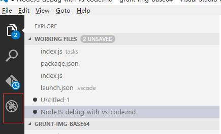
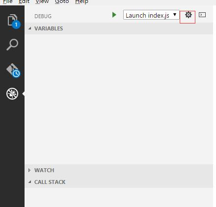
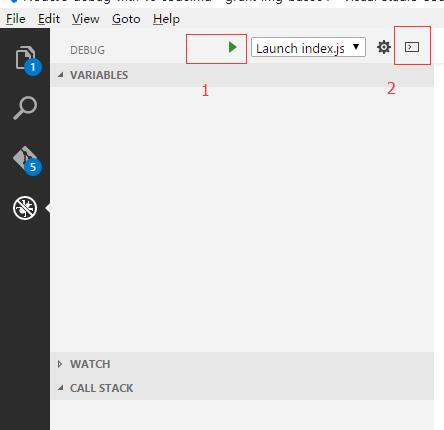

# Debug nodejs with visual studio code
### Install
* install visual studio code [download page](https://code.visualstudio.com/)
* install nodejs[download page](https://nodejs.org/en/)

### Steps
* create a nodejs project;
* create a new file index.js like this:
````javascript
var obj = {
	name: "Hello",
	value: "World"
};
for(var key in obj){
	var value = obj[key];
	// do something here...
	console.log(key + ":" + value);
}
````
* Switch the tab to debugger.   

* Click the configure button   

* Here is one configure example.
````javascript
{
	"version": "0.1.0",
	// List of configurations. Add new configurations or edit existing ones.
	"configurations": [
		{
			// Name of configuration; appears in the launch configuration drop down menu.
			"name": "Launch index.js",
			// Type of configuration.
			"type": "node",
			// Workspace relative or absolute path to the program.
			"program": "index.js",
			// Automatically stop program after launch.
			"stopOnEntry": false,
			// Command line arguments passed to the program.
			"args": [],
			// Workspace relative or absolute path to the working directory of the program being debugged. Default is the current workspace.
			"cwd": ".",
			// Workspace relative or absolute path to the runtime executable to be used. Default is the runtime executable on the PATH.
			"runtimeExecutable": null,
			// Optional arguments passed to the runtime executable.
			"runtimeArgs": ["--nolazy"],
			// Environment variables passed to the program.
			"env": {
				"NODE_ENV": "development"
			},
			// Use JavaScript source maps (if they exist).
			"sourceMaps": false,
			// If JavaScript source maps are enabled, the generated code is expected in this directory.
			"outDir": null
		},
		{
			"name": "Attach",
			"type": "node",
			// TCP/IP address. Default is "localhost".
			"address": "localhost",
			// Port to attach to.
			"port": 5858,
			"sourceMaps": false
		}
	]
}
````   
_Tips: Watch out for program and name property._
* Click the start button    
    
_Tips: Click button 1 to start debug, and click 2 to open a console._

## Happy debugging and Happy coding.  